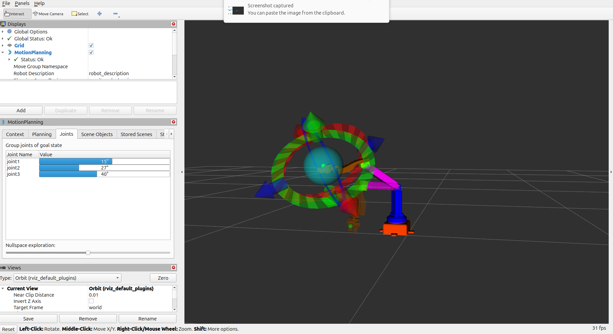
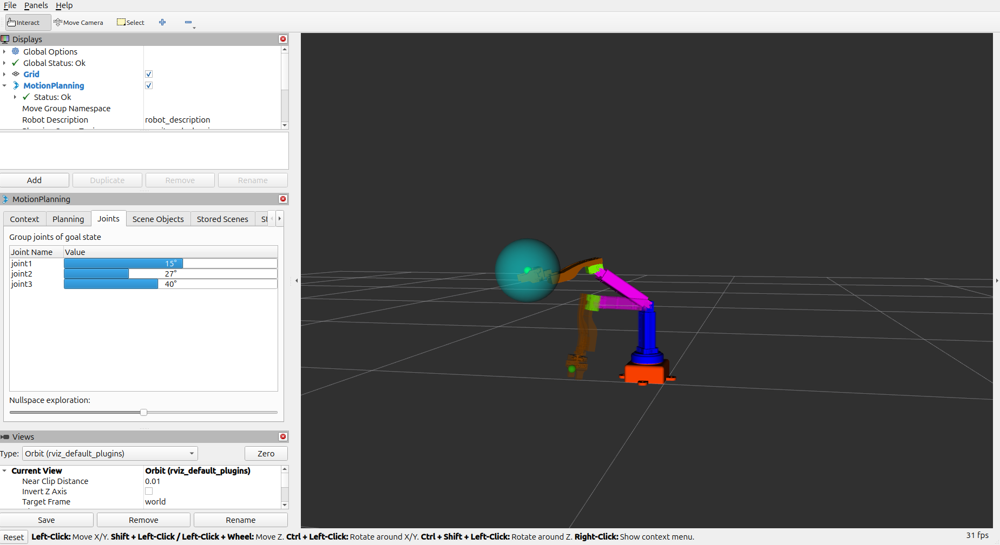
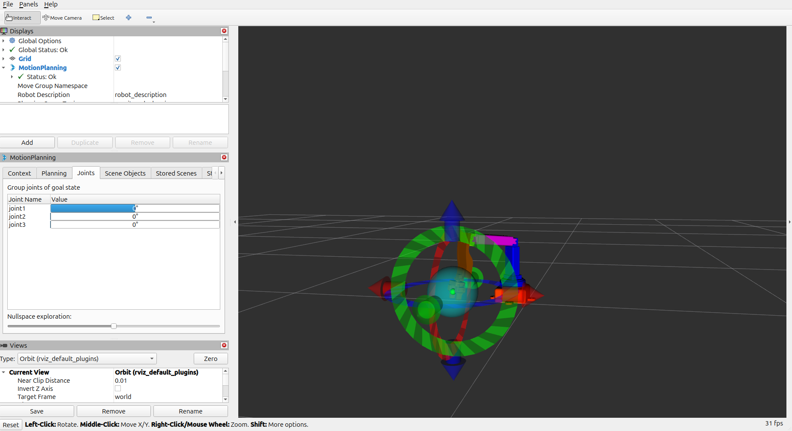
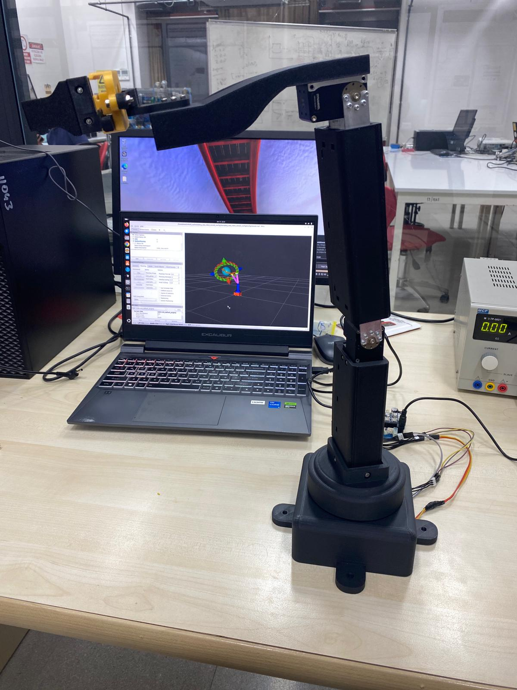
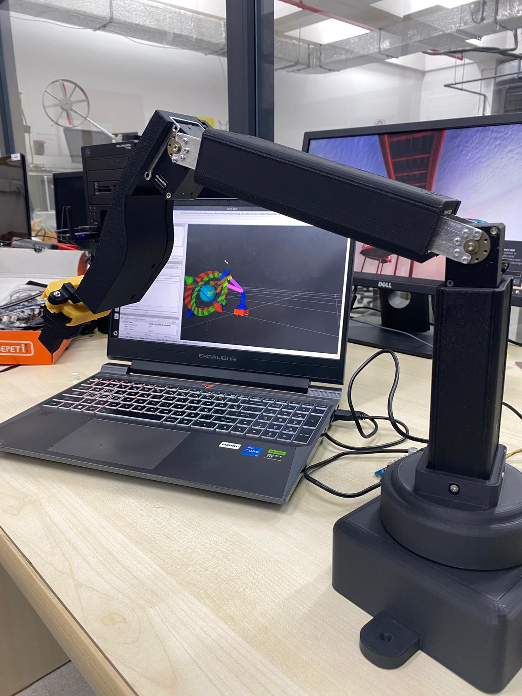

# 3DoF RRR Robot Arm - MoveIt-Dynamixel Control

ROS2 workspace project for controlling a 3DoF RRR robot arm using MoveIt and Dynamixel motors.

## 📸 Gallery

### RViz Visualization

The following screenshots show the robot arm being dragged to different desired positions in RViz, displaying the resulting joint angles:


*Robot arm configuration showing joint angles for position 1*


*Robot arm configuration showing joint angles for position 2*


*Robot arm configuration showing joint angles for position 3*

### Real System

The physical robot arm in operation:


*Physical 3DoF RRR robot arm in use*


*Robot arm performing tasks in real-world environment*

## 📋 Table of Contents

- [Gallery](#gallery)
- [Requirements](#requirements)
- [Installation](#installation)
- [Usage](#usage)
- [Project Structure](#project-structure)
- [Configuration](#configuration)
- [Contributors](#contributors)

## 🔧 Requirements

- **ROS2 Jazzy**
- **MoveIt2**
- **Dynamixel SDK Python package**: `pip install dynamixel-sdk`
- **Dynamixel motors** (X-Series) connected via USB

## 🚀 Installation

### 1. Clone the Repository

```bash
git clone <repository-url>
cd 3DoF_RRR_Robot_Arm
```

### 2. Build the Workspace

```bash
# Build the packages
colcon build

# Source the environment
source install/setup.bash
```

**Note:** You need to run `source install/setup.bash` every time you open a new terminal. Alternatively, you can add it to your `.bashrc` file for persistence:

```bash
echo "source $(pwd)/install/setup.bash" >> ~/.bashrc
```

### 3. Launch MoveIt

**Terminal 1:** Run the MoveIt launch file:

```bash
source install/setup.bash
ros2 launch 3DoF_RRR_Robot_Arm_moveit_config demo.launch.py
```

This command starts:
- Robot State Publisher (publishes URDF)
- Joint State Publisher GUI (for manual control)
- MoveIt Move Group (planning and control)
- RViz2 (visualization)

### 4. Run the Motor Synchronization Script

**Terminal 2:** Open a new terminal and run the motor synchronization script:

```bash
source install/setup.bash
ros2 run 3DoF_RRR_Robot_Arm_description moveit_direct_sync.py
```

## 💻 Usage

1. **After launching MoveIt**, the RViz window will open automatically
2. **In RViz**, you can visualize the robot arm
3. **Interactive Marker** allows you to drag and move the robot arm
4. **While the script is running**, joint angles from MoveIt are automatically sent to Dynamixel motors
5. **In Terminal 2**, you can see real-time angle values

### Control Methods

- **RViz Interactive Marker:** Drag the robot arm with the mouse to move it
- **Joint State Publisher GUI:** Manually control each joint using the sliders in the opened window
- **ROS2 Topic:** Programmatically send messages to the `/joint_states` topic

## 📁 Project Structure

```
3DoF_RRR_Robot_Arm/
├── src/
│   ├── 3DoF_RRR_Robot_Arm_description/          # Robot description (URDF + meshes)
│   │   ├── urdf/
│   │   │   └── 3DoF_RRR_Robot_Arm.urdf
│   │   ├── meshes/                               # STL mesh files
│   │   └── scripts/
│   │       └── moveit_direct_sync.py
│   └── 3DoF_RRR_Robot_Arm_moveit_config/         # MoveIt configuration
│       ├── config/
│       │   ├── 3DoF_RRR_Robot_Arm.srdf
│       │   ├── kinematics.yaml
│       │   ├── joint_limits.yaml
│       │   └── ompl_planning.yaml
│       └── launch/
│           └── demo.launch.py
└── README.md
```

### Packages

#### 3DoF_RRR_Robot_Arm_description
3DoF RRR robot arm description package:
- URDF file: `urdf/3DoF_RRR_Robot_Arm.urdf`
- Mesh files: `meshes/`
- Synchronization script: `scripts/moveit_direct_sync.py`

#### 3DoF_RRR_Robot_Arm_moveit_config
MoveIt configuration package for 3DoF RRR robot arm:
- SRDF file: `config/3DoF_RRR_Robot_Arm.srdf`
- Kinematics settings: `config/kinematics.yaml`
- Joint limits: `config/joint_limits.yaml`
- OMPL planning settings: `config/ompl_planning.yaml`
- Launch file: `launch/demo.launch.py`

## ⚙️ Configuration

- The script uses `/dev/ttyACM0` port. If you use a different port, change the port address in `scripts/moveit_direct_sync.py`
- Motor IDs and calibration values are defined in the script
- The script sends angles from MoveIt to motors with smoothing

## 👥 Contributors

- **Ömer Hamza ACAR** - omerhamza.acar20@gmail.com
- **Ömer Faruk ÜNAL** - ofu.951@gmail.com


---

